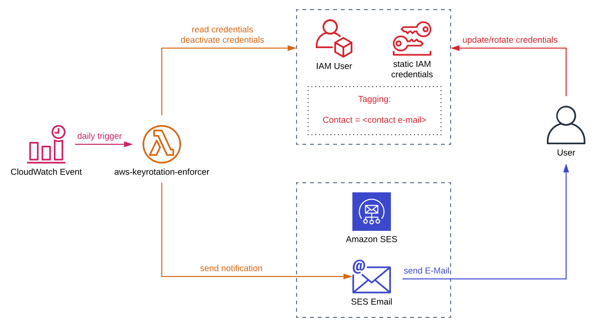

# AWS Keyrotation Enforcer
AWS Lambda Skripts to automatically enforce the rotation of AWS Access Keys with a certain age.

Used Environment Variables:
- SOURCEMAIL (required): Used as source E-Mail addresse in AWS SES
- NOTIFYKEYAGE: Key age in days after which a notification will be send to the technical contact

> The Key age for deactivation is calculated based on the NOTIFYKEYAGE. It is greater by 7 days, meaning the user has 7 days to rotate the AWS Access Key after he recieved the first notice. If the key is not rotated within that timeframe the key will be deactivated.

A sample diagramm on how the script is intended to be used can be seen below:



## Needed AWS IAM Permissions for Execution

The following minimal permissions are needed in Order for the Lambda Function to work properly.

```javascript
{
  "Version": "2012-10-17",
  "Statement": [
    {
      "Effect": "Allow",
      "Action": [
        "iam:GetUser",
        "iam:ListAccessKeys",
        "iam:UpdateAccessKey"
      ],
      "Resource": "arn:aws:iam::*:user/*"
    },
    {
      "Effect": "Allow",
      "Action": [
        "iam:ListUsers",
        "iam:ListUserTags",
        "ses:DeleteIdentity",
        "ses:GetIdentityVerificationAttributes",
        "ses:ListIdentities",
        "ses:VerifyEmailIdentity"
      ],
      "Resource": "*"
    },
    {
      "Effect": "Allow",
      "Action": "logs:CreateLogGroup",
      "Resource": "arn:aws:logs:*:*:*"
    },
    {
      "Effect": "Allow",
      "Action": "ses:SendEmail",
      "Resource": "arn:aws:ses:*:*:identity/*"
    },
    {
      "Effect": "Allow",
      "Action": [
        "logs:CreateLogStream",
        "logs:PutLogEvents"
      ],
      "Resource": [
        "arn:aws:logs:*:*:log-group:/aws/lambda/*:*"
      ]
    }
  ]
}
```

## Sample Deployment using AWS SAM

A sample AWS SAM application that could be used for the Lambda Function deployment is present in the folder [aws-keyrotation-enforcer-app](aws-keyrotation-enforcer-app/). The deployment has two parameters which need to be provided:

- SourceMail (required for notification): AWS SES validated source e-mail address
- NotifyKeyAge (optional): WS Credential Age after which a notification should be send (default 30 days)

The AWS SAM Deployment also creates the CloudWatch Event Rule that triggers the AWS Lambda function. The rule is at the moment configured to run at 8 AM UTC every day of the week.

## Prerequisites in v0.3.x

In v0.3.x the verification and validation of AWS SES E-Mail Identities is automatically handled. This includes the following types:

- SOURCEMAIL address provided via AWS SAM parameter as the e-mail sender
- Technical Contact addresses provided via `Contact` tag

> As the AWS SES API enforces that some verification request could only be send once per second, the AWS Lambda Timeout needs to be set accordingly high to verify all used E-Mail addresses.

IAM entities using static credentials (in this case AWS IAM users) need to be tagged according to the following scheme

| Key     | Value                                |
| ------- | ------------------------------------ |
| Contact | \<technical contact e-mail address\> |

